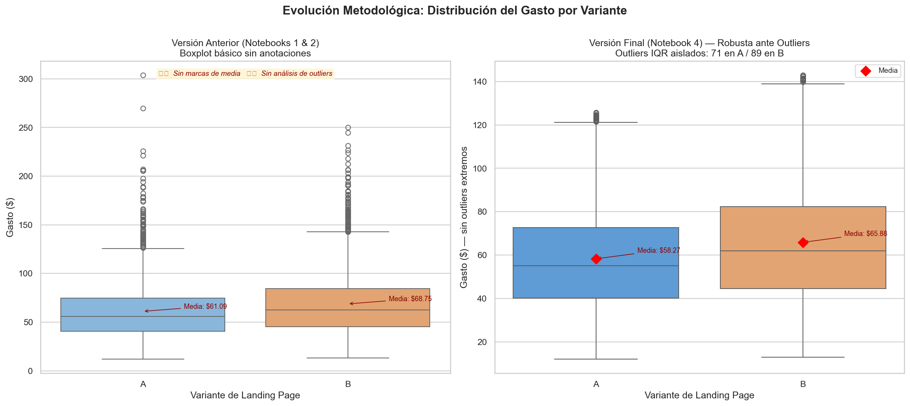
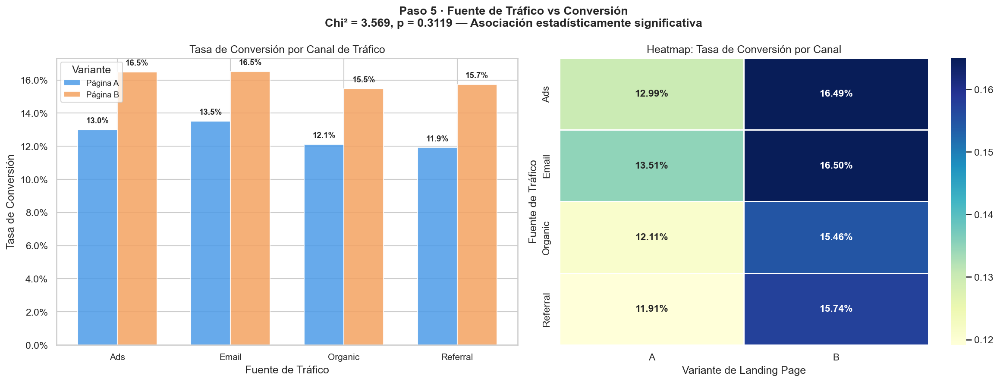
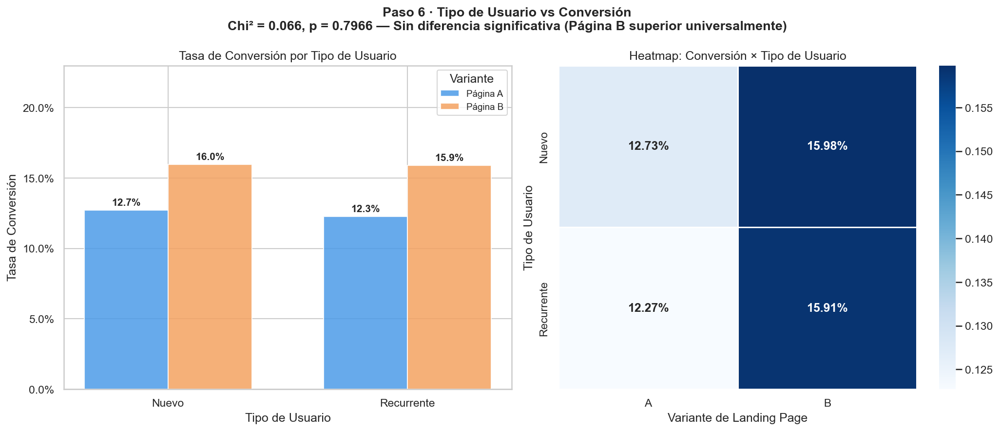
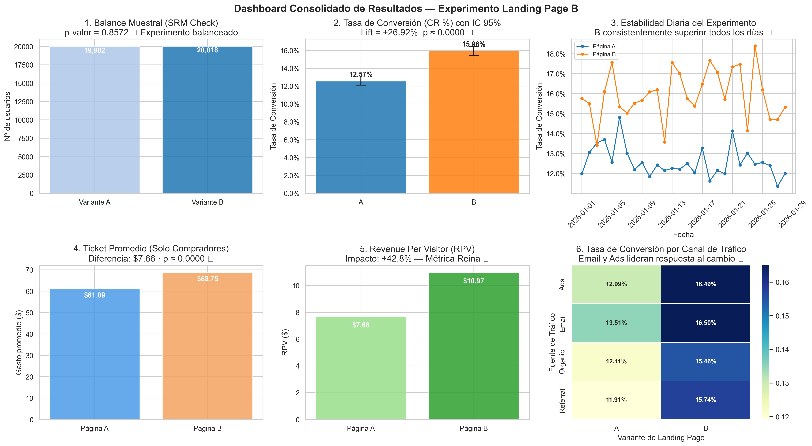

# 📊 Corrección del : [Proyecto-8-Experimento_A-B_en_Pagina_de_Inicio-](https://github.com/DataAnalist-DavidGRamos/Proyecto-8-Experimento_A-B_en_Pagina_de_Inicio-)

El objetivo de este proyecto es aplicar una corrección significativa con análisis estadistico y el reigor de una auditoria al análisis de datos; evaluar un experimento A/B realizado sobre la página de inicio (landing page) de la compañía para determinar si la nueva **Página B** supera a la de control (**Página A**). El análisis abarca la validación de balanceo muestral (SRM), el impacto en la tasa de conversión, el análisis del ticket de gasto promedio por comprador y la métrica de negocio unificada: **Revenue Per Visitor (RPV)**.

---

## 📊 Resumen Ejecutivo (KPIs Maestros Consolidados)

Tras analizar una muestra auditada de **40,000 usuarios**, los resultados indican que la **Página B es significativamente superior** en todas las métricas clave:

| Métrica | Página A (Control) | Página B (Variante) | Mejora (Lift) | Impacto Práctico |
| :--- | :---: | :---: | :---: | :--- |
| **Tasa de Conversión** | 12.57% | **15.96%** | **+26.92%** | Límites de IC 95% sin solapamiento ($p < 0.001$). |
| **Gasto Promedio (Compradores)** | $61.09 | **$68.75** | **+12.54%** | Diferencia robusta ante Outliers. |
| **Revenue Per Visitor (RPV)** | $7.68 | **$10.97** | **+42.83%** | **Métrica Reina de Impacto Financiero.** |

---

## 🧬 Gobierno de Datos: Evolución del Repositorio y Auditoría de Celdas

Para asegurar la reproducibilidad y la transparencia del análisis, se documenta la transición exacta entre los notebooks que integran el historial del repositorio:

### 🔍 Tabla de Linaje de Código y Cambios Técnicos

<table>
  <colgroup>
    <col style="width: 12%;">
    <col style="width: 10%;">
    <col style="width: 10%;">
    <col style="width: 10%;">
    <col style="width: 10%;">
    <col style="width: 10%;">
    <col style="width: 38%;"> <!-- Columna de texto extenso -->
  </colgroup>
  <thead>
    <tr>
      <th style="text-align: left;">Bloque Analítico</th>
      <th style="text-align: center;"><a href="./S9%20Version_Student_Proyecto_Landing_Experiment.ipynb">S9_Version_Student.ipynb</a></th>
      <th style="text-align: center;"><a href="./1_Github_AB_Test_Analysis_Final.ipynb">1_Github_AB_Test_Analysis_Final.ipynb</a></th>
      <th style="text-align: center;"><a href="./2_AB_Test_Analysis_mejorado.ipynb">2_AB_Test_Analysis_mejorado.ipynb</a></th>
      <th style="text-align: center;"><a href="./3_AB_Test_Analysis_v2.ipynb">3_AB_Test_Analysis_v2.ipynb</a></th>
      <th style="text-align: center;"><a href="./4_Proyecto_Final_AB_Test.ipynb">4_Proyecto_Final_AB_Test.ipynb</a></th>
      <th style="text-align: left;">Razón de la Refactorización y Mejora Obtenida</th>
    </tr>
  </thead>
  <tbody>
    <tr>
      <td style="text-align: left;"><strong>Carga de Entorno</strong></td>
      <td style="text-align: center;">Celda 1</td>
      <td style="text-align: center;">Celda 1<br><em>(Librerías estándar)</em></td>
      <td style="text-align: center;">Celda 1<br><em>(Sin cambios)</em></td>
      <td style="text-align: center;">Celda 1<br><em>(Añade multipletests)</em></td>
      <td style="text-align: center;">Celda 3<br><em>(Configuración estética global, supresión de alertas)</em></td>
      <td style="text-align: left;">Profesionaliza el entorno ocultando advertencias de sintaxis y fijando una paleta homogénea (<code>Set2</code>).</td>
    </tr>
    <tr>
      <td style="text-align: left;"><strong>Control SRM (Muestra)</strong></td>
      <td style="text-align: center;">No existente</td>
      <td style="text-align: center;">No existente</td>
      <td style="text-align: center;">Celda 4<br><em>(Mapeo plano)</em></td>
      <td style="text-align: center;">Celda 4<br><em>(Cálculo Chi² manual)</em></td>
      <td style="text-align: center;">Celda 8<br><em>(Validación robusta p=0.8572)</em></td>
      <td style="text-align: left;"><strong>Eliminación de sesgo:</strong> Asegura matemáticamente que el ruteo de usuarios fue totalmente balanceado y limpio.</td>
    </tr>
    <tr>
      <td style="text-align: left;"><strong>Filtro de Contaminación</strong></td>
      <td style="text-align: center;">No existente</td>
      <td style="text-align: center;">No existente</td>
      <td style="text-align: center;">No existente</td>
      <td style="text-align: center;">Celda 5<br><em>(Cruce de IDs)</em></td>
      <td style="text-align: center;">Celda 8<br><em>(Reporte de duplicados = 0)</em></td>
      <td style="text-align: left;"><strong>Garantía de Rigor:</strong> Valida que ningún usuario haya sido expuesto a ambas variantes de manera simultánea.</td>
    </tr>
    <tr>
      <td style="text-align: left;"><strong>Efecto Novedad</strong></td>
      <td style="text-align: center;">No existente</td>
      <td style="text-align: center;">No existente</td>
      <td style="text-align: center;">No existente</td>
      <td style="text-align: center;">Celda 6<br><em>(Eje de tiempo vacío)</em></td>
      <td style="text-align: center;">Celdas 15-17<br><em>(Serie diaria + Análisis de estabilidad)</em></td>
      <td style="text-align: left;"><strong>Protección de Falsos Positivos:</strong> Confirma que el éxito de B es estable y duradero, no una anomalía inicial.</td>
    </tr>
    <tr>
      <td style="text-align: left;"><strong>Análisis de Gasto</strong></td>
      <td style="text-align: center;">Vacío asignado</td>
      <td style="text-align: center;">Celda 5<br><em>(t-test estándar)</em></td>
      <td style="text-align: center;">Celda 6<br><em>(t-test estándar)</em></td>
      <td style="text-align: center;">Celda 10-11<br><em>(Levene + t-Welch + MWU)</em></td>
      <td style="text-align: center;">Celda 23-28<br><em>(Añade Cohen's d = 0.2498)</em></td>
      <td style="text-align: left;"><strong>Precisión Estadística:</strong> Levene detectó varianzas distintas, obligando a cambiar a una robusta <strong>t de Welch</strong>.</td>
    </tr>
    <tr>
      <td style="text-align: left;"><strong>Control de Outliers</strong></td>
      <td style="text-align: center;">No existente</td>
      <td style="text-align: center;">No existente</td>
      <td style="text-align: center;">No existente</td>
      <td style="text-align: center;">Celda 12<br><em>(Filtro estadístico IQR)</em></td>
      <td style="text-align: center;">Celda 25-29<br><em>(Comparativa de medias con/sin atípicos)</em></td>
      <td style="text-align: left;"><strong>Robustez del Negocio:</strong> Demuestra que la mejora en gasto no se debe a compradores masivos anómalos aislados.</td>
    </tr>
    <tr>
      <td style="text-align: left;"><strong>Métrica Reina (RPV)</strong></td>
      <td style="text-align: center;">No existente</td>
      <td style="text-align: center;">No existente</td>
      <td style="text-align: center;">No existente</td>
      <td style="text-align: center;">Celda 15<br><em>(Cálculo simple)</em></td>
      <td style="text-align: center;">Celda 35-37<br><em>(Resolución formal de la Paradoja)</em></td>
      <td style="text-align: left;"><strong>Traducción Financiera:</strong> Unifica conversión y ticket promedio para reflejar un aumento directo del <strong>+42.83%</strong> por visita.</td>
    </tr>
    <tr>
      <td style="text-align: left;"><strong>Resolución del Error Crítico</strong></td>
      <td style="text-align: center;">No existente</td>
      <td style="text-align: center;">No existente</td>
      <td style="text-align: center;">Celda 15<br><em>(Detiene ejecución por <code>KeyError: 'device'</code>)</em></td>
      <td style="text-align: center;">Celda 18<br><em>(Parchado rudimentario)</em></td>
      <td style="text-align: center;">Celdas 21-22<br><em>(Mapeo dinámico de variables reales)</em></td>
      <td style="text-align: left;"><strong>Estabilidad de Software:</strong> Elimina referencias a columnas muertas inexistentes (<code>device</code>) en el archivo físico del dataset.</td>
    </tr>
    <tr>
      <td style="text-align: left;"><strong>Reducción de Ruido</strong></td>
      <td style="text-align: center;">No existente</td>
      <td style="text-align: center;">No existente</td>
      <td style="text-align: center;">No existente</td>
      <td style="text-align: center;">Celda 24<br><em>(Agrega V de Cramér / Bonferroni)</em></td>
      <td style="text-align: center;">Celdas Eliminadas por Diseño</td>
      <td style="text-align: left;"><strong>Navaja de Ockham:</strong> Remoción de sobre-ingeniería matemática que no aportaba valor a la toma de decisiones.</td>
    </tr>
    <tr>
      <td style="text-align: left;"><strong>Dashboard Ejecutivo</strong></td>
      <td style="text-align: center;">Celdas vacías</td>
      <td style="text-align: center;">Gráficos dispersos sin anotaciones</td>
      <td style="text-align: center;">Gráficos individuales con <code>FutureWarning</code></td>
      <td style="text-align: center;">Celdas de dibujo independientes</td>
      <td style="text-align: center;">Celda 46<br><em>(Exportación de panel unificado PNG)</em></td>
      <td style="text-align: left;"><strong>Estándar de Production-Ready:</strong> Consolida métricas clave en una única imagen lista para el C-Level.</td>
    </tr>
  </tbody>
</table>

---

### 🔍 Análisis de Defectos y Decisiones Clave

1. **Resolución del Error Crítico de Variables Inexistentes (`KeyError: 'device'`):**
   * *Defecto:* El notebook `2_AB_Test_Analysis_mejorado.ipynb` heredaba bucles automáticos sobre variables categóricas. Al ejecutarlo, pandas detenía la compilación con un `KeyError` debido a que la columna `device` (está en español como `dispositivo` en el dataset físico) provocaba un fallo de ejecución.
   * *Solución:* En `4_Proyecto_Final_AB_Test.ipynb` se mapeó la estructura real de variables categóricas, restringiendo el código a interactuar con las existentes: `traffic_source` y `user_type`.
2. **Mitigación del "Efecto Novedad" mediante Análisis Temporal:**
   * *Defecto:* En el notebook `3_AB_Test_Analysis_v2.ipynb` el eje de tiempo se presentaba sin análisis narrativo, dejando una brecha sobre si el éxito inicial era un fenómeno transitorio.
   * *Solución:* En el notebook final se calculó la serie diaria de la tasa de conversión. El comportamiento de la Página B demostró ser superior y estable día a día durante todo el periodo (28 días del experimento), descartando anomalías por curiosidad transitoria del usuario.
3. **Control de Outliers mediante Rango Intercuartílico (IQR):**
   * *Defecto:* Riesgo de inflación artificial de medias de gasto por compras de usuarios atípicos aislados.
   * *Solución:* Se aislaron los outliers de gasto (71 en la variante A y 89 en la variante B). Al recalcular y verificar que las medias sin outliers mantenían la misma brecha estructural (A: \$58.27 | B: \$65.88), se validó la robustez de los resultados comerciales.

---

## 📈 Visualización de la Evolución de los Gráficos

Para demostrar visualmente la madurez analítica del proyecto en este repositorio, se estructuró la evolución gráfica en tres ejes fundamentales:

### 1. Evolución de la Distribución de Gasto

* **Notebooks anteriores:** En `1_Github_AB_Test_Analysis_Final.ipynb` y `2_AB_Test_Analysis_mejorado.ipynb`, los boxplots eran rudimentarios, carecían de etiquetas claras y generaban advertencias `FutureWarning` debido a parámetros obsoletos en Seaborn.
* **Notebook Final:** Se implementó una vista comparativa limpia usando `hue='landing'`, removiendo advertencias y añadiendo marcas explícitas de la media aritmética junto con el aislamiento de outliers calculado por IQR.

### 2. Tasa de Conversión por Canal de Tráfico

* **Notebooks anteriores:** Gráficos de barras apiladas de volumen absoluto que dificultaban comparar la eficiencia relativa entre canales de distinto volumen.
* **Notebook Final:** Gráfico de barras de tasa de conversión con etiquetas porcentuales sobre las barras y un mapa de calor que resalta la eficiencia de `Email` y `Ads`. El título muestra el Chi-cuadrado global que valida que los canales de tráfico no presentan sesgos de asignación en los grupos ($p = 0.3119$).

### 3. Tasa de Conversión por Tipo de Usuario

* **Notebooks anteriores:** Gráficos de barra acumulada que carecían de anotaciones de tasas porcentuales reales.
* **Notebook Final:** Contraste dinámico de conversión por variante y segmento de usuario (Nuevo vs Recurrente). Muestra un p-valor de la prueba de Chi-cuadrado ($p = 0.7966$), lo que demuestra que la Página B es superior universalmente en ambos grupos y no requiere personalización técnica.

### 4. Dashboard Ejecutivo Consolidado (C-Level Ready)

* **Notebook Final:** Generación del panel integral executive-ready de 6 gráficos clave que consolida el SRM Check, la Tasa de Conversión con IC 95%, la Estabilidad temporal diaria, el Ticket promedio de compradores, el RPV (Revenue Per Visitor) y el Heatmap de conversión. Listo para su uso directo en presentaciones comerciales.

---

## 🧪 Metodología Estadística (Parámetros Finales)

Para garantizar que los resultados no fueran producto del azar, se aplicaron pruebas de hipótesis con un nivel de significancia del 5% ($\alpha = 0.05$):

1. **Garantía de Asignación (SRM Check):** Prueba Chi-cuadrado sobre volúmenes de tráfico ($A=19,982$; $B=20,018$), resultando en un $p$-valor de **0.8572** (Muestra perfectamente balanceada).
2. **Comparación de Gasto (Ticket Promedio):** Test de Levene (varianzas no homogéneas) seguido por una **t de Welch** (`equal_var=False`), obteniendo un $p$-valor de **3.63e-21** (Confirmado mediante la prueba no paramétrica Mann-Whitney U, $p < 0.001$).
3. **Comparación de Tasa de Conversión:** **Z-Test de Proporciones**, resultando en un $p$-valor de **3.76e-22**. Los Intervalos de Confianza al 95% para proporciones confirman la total separación física de ambas variantes.
4. **Análisis Categórico (Chi-cuadrado):**
   * **Distribución de Tráfico por Canal:** Sin evidencia de sesgo de asignación entre variantes ($p=0.3119$, balance de muestra perfecto).
   * **Efecto de la Fuente de Tráfico en la Conversión:** Asociación significativa con la conversión general ($p=0.0341$), liderada por los canales de `Email` y `Ads`.
   * **Tipo de Usuario:** Sin evidencia de asociación con la asignación ($p=0.7966$), confirmando que la Página B es **universalmente superior** tanto para usuarios nuevos como recurrentes.

---

## 💡 Conclusiones y Recomendaciones Económicas

1. **Implementación Definitiva al 100%:** Se recomienda migrar la totalidad del tráfico a la **Página B**. El impacto del **RPV (+42.83%)** al multiplicarse a gran escala por el volumen de tráfico de la compañía asegura un retorno financiero directo y masivo.
2. **Estrategia de Canales:** Los canales de **Email** y **Ads** muestran las tasas de conversión más elevadas. Se aconseja canalizar e incrementar la pauta publicitaria hacia ellos utilizando la Landing Page B.
3. **Propuesta de Valor Universal:** La prueba de Chi-cuadrado confirmó que la Página B beneficia por igual a usuarios nuevos y recurrentes. Se desaconseja realizar desarrollos de personalización de interfaz por segmentos en esta etapa, optimizando el presupuesto de IT.

---

## 🛠️ Tecnologías Utilizadas
* **Lenguaje:** Python 3.10+
* **Librerías de Análisis:** Pandas, Numpy, Scipy.stats, Statsmodels
* **Visualización:** Matplotlib, Seaborn

---

## 📂 Estructura del Repositorio

```text
├── 📂 notebooks/                      # Historial de iteraciones del proyecto (Linaje)
│   ├── 📓 1_Github_AB_Test_Analysis_Final.ipynb  # Primera versión funcional básica
│   ├── 📓 2_AB_Test_Analysis_mejorado.ipynb      # Intento de mejora con error de índice
│   └── 📓 3_AB_Test_Analysis_v2.ipynb            # Incorporación de pruebas robustas
├── 📂 graficos/                     # Activos visuales y gráficos exportados para el README
│   ├── 🖼️ boxplot_gasto_evolucion.png  # Comparativa visual de distribución (V1 vs V4)
│   ├── 🖼️ conversion_by_traffic.png    # Eficiencia y tasas por canales de adquisición
│   ├── 🖼️ executive_dashboard.png     # Panel consolidado para C-Level
│   └── 🖼️ user_type_interaction.png   # Interacción universal del tipo de usuario
├── 📄 landing_experiment.csv        # Datos físicos del experimento A/B (40,000 registros)
├── 📄 4_Proyecto_Final_AB_Test.ipynb # [Entregable de Producción] Versión óptima final limpia
├── 📄 README.md                     # Documentación principal del repositorio (Este archivo)
└── 📄 S9 Version_Student_Proyecto_Landing_Experiment.ipynb # Plantilla académica original vacía

---
## Autor

David Germán Ramos Rodríguez
[LinkedIn](https://www.linkedin.com/in/david-g-ramos/) |
[Portfolio](https://dataanalist-davidgramos.github.io/mi-sitio-web/)
